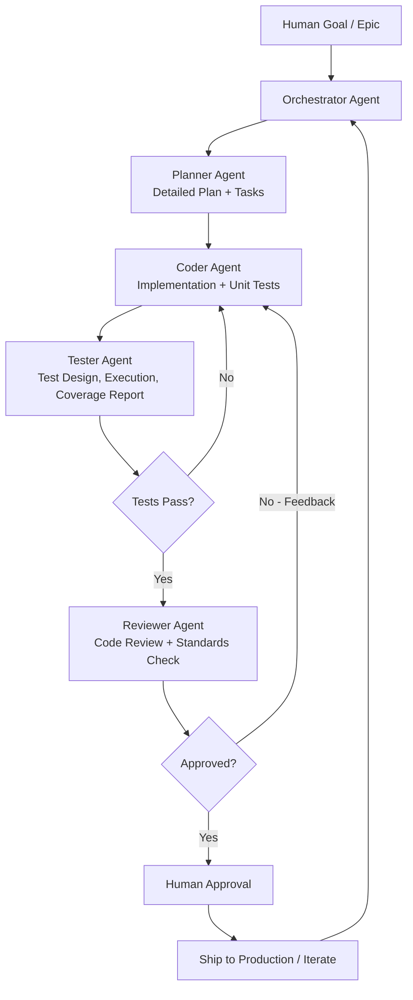

# ARCHITECTURE.md

## High-Level System Architecture

### Overview

This project follows a **multi-agent collaborative development** model. The Forge Agent Team consists of 5 specialized agents that work together in a structured workflow to deliver high-quality, maintainable software for the Forge task manager platform.

### Core Components

1. **Human / Orchestrator Interface**
   - Provides high-level goals, priorities, and final approval
   - Can trigger "John" persona or directly instruct any agent
   - Full override authority at every stage

2. **Forge Agent Team** (see `agents/AGENT_TEAM.md`)
   - **Orchestrator Agent**: Team lead and workflow coordinator. Manages task assignment, resolves blockers, maintains overall project state.
   - **Planner Agent**: Requirements analyst and strategist. Creates detailed implementation plans, breaks down epics into tasks, identifies dependencies and risks.
   - **Coder Agent**: Implementation specialist. Writes production-ready code following all standards and architecture.
   - **Tester Agent**: Quality assurance specialist. Designs, implements, and executes comprehensive test suites (unit, integration, e2e). Ensures coverage and catches regressions.
   - **Reviewer Agent**: Code quality guardian. Performs rigorous reviews, enforces standards, suggests improvements, and approves merges.

3. **Shared Knowledge Base**
   - `CLAUDE.md` — Central source of truth + persona trigger
   - `ARCHITECTURE.md` — This file (system design)
   - `CODING_STANDARDS.md` — Coding rules, exception handling, tooling
   - `DECISIONS.md` — Architectural Decision Records (ADRs)
   - Project-specific docs (e.g., API specs, UI guidelines)

### Collaboration Workflow (with Feedback Loops)

**Key Workflow Rules:**
- Every handoff includes explicit artifacts (plans, code diffs, test reports, review comments)
- Feedback loops are mandatory — agents must cite specific issues and reference CLAUDE.md / standards
- Human can inject at any point or force re-execution of any stage
- Orchestrator can re-assign or escalate when stuck

### Technology Stack (Forge Task Manager)

- **Frontend**: React + TypeScript + Tailwind (modern, accessible)
- **Backend**: Python (FastAPI) + PostgreSQL
- **Testing**: pytest (unit/integration), Playwright (e2e), coverage.py
- **CI/CD**: GitHub Actions with mandatory test gates
- **Observability**: Structured logging + Prometheus metrics
- **Deployment**: Docker + Kubernetes (future)

### Key Architectural Principles

- **Separation of Concerns** — Each agent owns exactly one phase of delivery
- **Explicit Contracts** — All agent outputs follow strict, versioned schemas (markdown + optional JSON)
- **Traceability** — Every line of code or decision links back to a plan or ADR in DECISIONS.md
- **Fail Fast & Safe** — Prefer explicit errors, comprehensive tests, and human review over silent failures
- **Documentation-Driven** — No feature is "done" until docs, tests, and reviews are complete

### Non-Functional Requirements

- Security by design (OWASP Top 10, input validation everywhere)
- High observability (logs, metrics, traces)
- Performance: <200ms p95 for core task operations
- Scalability: Support 10k+ concurrent users (future)
- Accessibility: WCAG 2.2 AA compliance

---

*This document is living. Update it whenever the architecture evolves. Last major update: 2026-05-24 (added Tester Agent + full 5-agent team)*