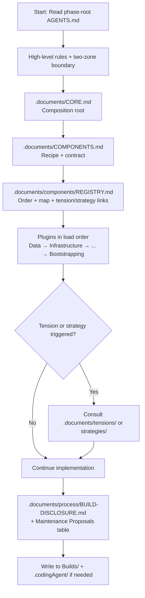
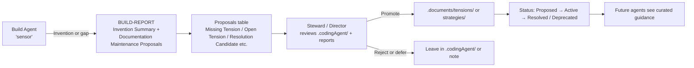
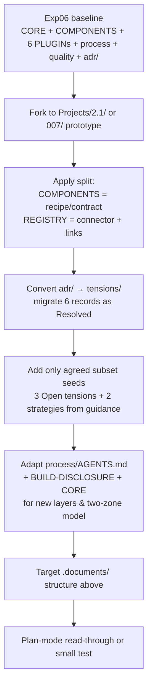
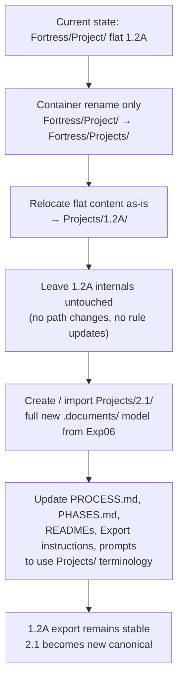

# Phase 2.1 + `Fortress/Projects` Restructure Plan

**Date:** 2026-06-24  
**Status:** Draft for Director / Research / Steward review  
**Related:** 
- [Experiment 07 Director Final Call](../Ribosome/Experiments/007/Experiment-07-Director-Final-Call-Decisions-1-2-3-2026-06-23.md)
- [PHASE_2_PROPOSALS.md](./PHASE_2_PROPOSALS.md)
- `Fortress/PROCESS.md`, `Fortress/Project/PHASES.md` (to be migrated)

---

## 1. Goals

1. **Introduce Phase 2.1** with the approved documentation architecture:
   - Unified `tensions/` (Open / Resolved / Deprecated) replacing previous `adr/` + seams thinking.
   - Separate `strategies/` folder.
   - `components/REGISTRY.md` as the connector layer.
   - Clear separation: `.documents/` (authoritative, steward-owned) vs `.codingAgent/` (agent proposals).
   - Agents act strictly as sensors; maintenance flows through reports + promotion.

2. **Rename the agent product container**:
   - Change `Fortress/Project/` → `Fortress/Projects/` (plural).
   - Better reflects that this is a container for one or more named phase projects (`2.1/`, `1.2A/`, etc.).
   - Update every reference, procedure, prompt instruction, and handoff artifact.

3. **Establish a clean migration path** so Phase 1.2A continues to work while new work uses the Phase 2.1 model and the new top-level name.

---

## 2. Rationale for the Rename (in this plan)

- "Project" singular became misleading as soon as we planned multiple phases under it.
- "Projects" makes the container semantics obvious in `PROCESS.md`, `PHASES.md`, export instructions, and shootout prompts.
- Opportunity to perform the rename at the same time we introduce the first new-architecture phase (2.1), minimizing future churn.
- Aligns with language already used informally ("phase projects").

All language in this plan uses the target `Projects/` terminology.

---

## 3. Target Structure After Completion

```
Fortress/
├── Projects/                           ← Replaces old Fortress/Project/
│   ├── PHASES.md                       ← Lightweight phase index (Director/steward only)
│   ├── 1.2A/                           ← Current flat content migrated here
│   │   ├── AGENTS.md
│   │   ├── BuildDisclosure.md
│   │   ├── README.md
│   │   ├── Evaluation/
│   │   └── .docs/                      (legacy style — read-only during 1.2A builds)
│   │
│   └── 2.1/                            ← First phase using new architecture
│       ├── AGENTS.md                   ← Entry point (highest authority for agents)
│       ├── Builds/                     ← Combined build reports + cartography
│       ├── .documents/                 ← **Authoritative** (steward promotes into)
│       │   ├── CORE.md                 (composition orchestration)
│       │   ├── COMPONENTS.md           (recipe + pattern + PLUGIN.md contract)
│       │   ├── components/
│       │   │   ├── REGISTRY.md         (load order, inventory, cross-links)
│       │   │   ├── Data/PLUGIN.md
│       │   │   ├── Infrastructure/PLUGIN.md
│       │   │   ├── Security/PLUGIN.md
│       │   │   ├── Logging/PLUGIN.md
│       │   │   ├── Actions/PLUGIN.md
│       │   │   └── Bootstrapping/PLUGIN.md
│       │   ├── tensions/               (Open | Resolved | Deprecated)
│       │   │   └── (migrated ADRs + new seeds)
│       │   ├── strategies/             (behavioral choices)
│       │   ├── process/
│       │   │   ├── AGENTS.md
│       │   │   └── BUILD-DISCLOSURE.md
│       │   └── quality/
│       │       ├── EvaluationCriteria.md
│       │       └── ...
│       └── .codingAgent/               ← Agent-writable proposals, drafts, feedback only
│           └── (never treated as authoritative)
│
├── Export/
│   ├── Phase 1.2A/
│   │   ├── Projects/                   ← Updated inner folder name
│   │   ├── Prompts/
│   │   └── Fortress-Phase1.2A-....zip
│   │
│   └── Phase 2.1/
│       ├── Projects/                   ← Full authoritative copy of 2.1 contents
│       ├── Prompts/
│       └── Fortress-Phase2.1-....zip
│
├── Research/Ribosome/Experiments/007/  ← Historical planning only (after promotion)
├── Handoff/
├── Logs/
├── PROCESS.md                          ← Updated to describe Projects/
├── README.md
└── STATUS.md
```

**Export inner folder convention (new):**  
Every `Export/Phase X.Y/` contains a `Projects/` folder (the thing copied to a shootout workspace).  
Shootout instructions will say: "Copy `Export/Phase 2.1/Projects/` to your build root."

---

## 4. Phase 2.1 `.documents/` Design Requirements (Locked Decisions Applied)

Baseline: Fork content from `Research/Ribosome/Experiments/006/` (the DI-pattern package that scored 8/10 in plan-mode review).

### 4.1 Folder & Layer Rules
- Follow Director Final Call layout sketch exactly (folder names `.documents` and `.codingAgent` are non-negotiable).
- `.documents/` = read-only for agents.
- `.codingAgent/` = proposals only; steward promotes.
- `tensions/` and `strategies/` are first-class peers of `COMPONENTS.md`.

### 4.2 Content Split (Canonical)
| Location                        | Content Responsibility |
|---------------------------------|-------------------------|
| `COMPONENTS.md`                 | Component pattern, architectural style, technology stack, "adding a plugin" rules, full `PLUGIN.md` contract |
| `components/REGISTRY.md`        | Load/registration order table, dependency map, plugin inventory + paths, links to relevant tensions & strategies |

### 4.3 Tensions & Strategies
- Migrate the 6 existing `adr/` records from Exp06 into `tensions/` as **Resolved** Tension Records (preserve decision text, add missing sections where thin).
- Initial prototype cap: **maximum 3 Open tensions + 2 strategies**.
- Seed candidates (Proposed → Open on creation):
  - Tensions: Wrong-password / first-run UX, Schema bootstrap paths, Export-backup edges.
  - Strategies: Save strategy (elevate from adr/0004), Disclosure + maintenance (new Era C pattern).
- Every tension file uses a consistent **Tension Record** template.

### 4.4 Minimum Viable Tension Record Template (to be finalized during design)
```markdown
# Tension 000X — Short Descriptive Title

## Status
Open | Resolved | Deprecated

## Description
...

## Why It Matters
...

## Affected Areas
- components/...

## Current State / Workarounds
...

## Resolution (only when Status = Resolved)
- **Decision**:
- **Rationale**:
- **Consequences**:
- **Acceptance Criteria**:

## Related Tensions
...

## Notes / History
```
Numbering continues from the old ADR sequence (`0001-...`).

### 4.5 Process & Report Updates (inside `.documents/process/`)
- Rewrite Rule 5 (Documentation Boundary) to describe the two-zone model.
- Add mandatory read-order section that agents must follow:
  1. `process/AGENTS.md` (root or under .documents/process)
  2. `.documents/CORE.md`
  3. `.documents/COMPONENTS.md`
  4. `.documents/components/REGISTRY.md`
  5. Plugins in load order
  6. When relevant: specific tensions/strategies
- Extend `BUILD-DISCLOSURE.md` with the **Documentation Maintenance Proposals** table (include new row types: Missing Tension, Open Tension — insufficient guidance, Resolution Candidate, Deprecated Tension candidate, Missing Strategy).

### 4.6 CORE.md Updates
Reflect the new layers:
- Recipe (CORE + COMPONENTS)
- Ingredients (PLUGIN.md files)
- Connector (REGISTRY)
- Governance (tensions + strategies)

---

## 5. Execution Plan (Sequenced Steps)

### Phase A — Plan Approval & High-Level Documentation (Steward + Research)
1. Review and approve this plan (Director final call if needed).
2. Create or update any supporting design notes (e.g. Tension Record template draft).
3. Update `PROCESS.md` to describe the new `Projects/` container, promotion flow, and export steps using plural terminology (keep historical notes where useful).
4. Update `Fortress/README.md` folder table and critical rules.
5. Update `STATUS.md` current state and inventory sections (future tense for the rename).

### Phase B — Rename & 1.2A Migration (Steward)
6. Rename on disk: `Fortress/Project/` → `Fortress/Projects/`.
7. Move the current flat 1.2A files into `Projects/1.2A/` (or keep flat under `Projects/` with a clear marker; prefer subfolder for consistency).
8. Place `PHASES.md` at `Projects/PHASES.md` and update its table to use new paths.
9. Update every reference inside the 1.2A content (AGENTS.md, README.md, etc.).
10. Update all cross-references across the entire `fortress-design` repo (use grep + search-replace).
11. Refresh `Export/Phase 1.2A/` (mirror the new location) or clearly mark the old zip as historical.

**Deliverable:** `Projects/` is the live container; old `Project/` no longer exists in active tree.

### Phase C — Phase 2.1 Prototype Construction & .documents/ Design (Steward + Research support)
12. Fork Exp06 documentation tree as the base for `Projects/2.1/` (can prototype first under `Research/.../007/` then promote, per existing process).
13. Scaffold the full target layout under `Projects/2.1/`:
    - Root `AGENTS.md`
    - `Builds/`
    - `.documents/` + substructure per Director sketch
    - `.codingAgent/`
14. Perform the content work:
    - Slim / split `COMPONENTS.md` and create `components/REGISTRY.md`
    - Migrate ADRs → `tensions/`
    - Create seed tension and strategy files using the agreed template
    - Update `process/AGENTS.md` and `BUILD-DISCLOSURE.md`
    - Update `CORE.md`
15. Populate minimal supporting files in `quality/`.
16. Ensure `AGENTS.md` at `2.1/` root correctly points agents at the new read order and boundaries.
17. Update `Projects/PHASES.md` to mark 2.1 as created (location `Projects/2.1/`).

**Prototype cap enforcement:** Only the agreed number of new tension/strategy files on first pass.

### Phase D — Export, Validation & Promotion
18. Create `Export/Phase 2.1/` containing a clean `Projects/` copy + `Prompts/`.
19. Generate the initial zip using the established naming convention.
20. Add a dated entry in `Logs/` and update `STATUS.md`.
21. Verify that all active process documents (PROCESS.md, prompts, handoff summaries) now reference the correct `Projects/` paths.
22. (Optional but recommended) Perform a plan-mode or small test read-through with the new package.

### Phase E — Cleanup & Historical Hygiene
23. Global search for any remaining "Fortress/Project/" or "Project/" (in agent context) strings and correct or annotate them.
24. Add a short `MIGRATION.md` note (or section in PROCESS.md) describing the rename date and that pre-2026-06-xx exports use the old name.
25. Archive or clearly label old Experiment 06/07 planning docs as historical.

---

## 6. Key Files Requiring Updates

**High impact (many references):**
- `Fortress/PROCESS.md`
- `Fortress/README.md`
- `Fortress/STATUS.md`
- `Projects/PHASES.md` (post-rename)
- `Projects/2.1/AGENTS.md` and `Projects/1.2A/AGENTS.md`
- All `Export/Phase */` READMEs or instructions
- `handoff-audit.md`, `Fortress-Handoff-*.md`, Handoff/*.md

**Medium:**
- Research backlogs, ideas, and experiment READMEs
- Logs/*.md (historical accuracy)
- Any prompts that contain literal paths

**Phase 2.1 specific (new files or heavy edits):**
- All files under `Projects/2.1/.documents/`
- `Projects/2.1/process/BUILD-DISCLOSURE.md`
- Tension Record template (can live in `quality/AUTHORING-GUIDANCE.md` or a new `tensions/TEMPLATE.md`)

---

## 7. Open Questions / Decisions to Resolve During Execution

- Should the inner export folder for Phase 1.2A be left as `Project/` temporarily for compatibility with existing shootout instructions, or updated immediately?
- Exact numbering and initial wording for the first 3 tension files (Research to propose concrete drafts).
- Whether `tensions/REGISTRY.md` lives as a separate file or as a section/table inside the main `components/REGISTRY.md`.
- How aggressively to prune legacy `perspectives/`, `archive/`, and old `.docs/` content when forking into 2.1.

These should be closed before or during Phase C.

---

## 8. Success Criteria

- `Fortress/Projects/` is the single source of truth for all active agent packages.
- `Projects/2.1/` contains a complete, self-describing package using `.documents/` + `tensions/` + `strategies/` + REGISTRY split.
- Any agent or human following the updated `PROCESS.md` can locate the correct folder for a given phase and understand the read-only vs proposal boundary.
- No "silent" references to the old `Project/` name remain in current process or handoff documents.
- At least one successful plan-mode or build attempt uses the Phase 2.1 package (directional signal only).

---

## 9. Recommended First Action After Approval

Steward begins Phase A updates to `PROCESS.md` and `README.md`, then executes the rename (Phase B) before heavy content work on 2.1.

Once the container rename is done, the design and population of `Projects/2.1/.documents/` can proceed in parallel with any remaining 1.2A stabilization.

---

## 2026-06-24 Discussion Notes — Exp06 Content into the New Structure

We circled back on whether to really "push thru" and bring the important existing content from Experiment 06 forward when we stand up the new `Projects/2.1/` structure (with `.documents/`, `tensions/`, the REGISTRY split, etc.).

### The lean
Yes — selectively and deliberately — but not a full port.

### Why push on Exp06 content
Exp06 is the cleanest recent baseline. It already has the DI-shaped plugins (`CORE.md` + `COMPONENTS.md` + the six `PLUGIN.md` files), the collapsed process docs, and the six ADRs that came out of earlier work. Those pieces represent real investment and the state that got the strongest executability score so far (plan-mode 8/10). Since Phase 2.1 guidance was written explicitly as the evolution of that package, it feels right to use it as the actual source when we fork into the new layout.

Carrying the good content forward also gives the new structure immediate substance instead of feeling like a thin skeleton while we wait for future builds to "emerge" everything.

### How to do it without breaking the spirit of Phase 2.1
- Fork the Exp06 tree as the base for `Projects/2.1/`.
- Migrate the **executable core** into the new places:
  - The six component `PLUGIN.md` files go under `.documents/components/`.
  - Split the old combined `COMPONENTS.md` (keep the recipe/pattern/contract side there; move load order + cross-links into the new `components/REGISTRY.md`).
  - Move and lightly adapt `process/AGENTS.md` + `BUILD-DISCLOSURE.md` (add the Maintenance Proposals table and the two-zone boundary language).
  - Update `CORE.md` to describe the new Recipe / Ingredients / Connector + tensions/strategies model.
- Convert the existing ADRs into `tensions/` records (marked Resolved, preserving the decision text).
- Add **only** the small prototype set of new Open tensions and strategies as seeds (the three candidates we already listed + the two strategies).
- Do **not** rewrite the detailed specs inside the plugins or try to re-curate every old note during the move. The structural change is the main event.
- Leave `perspectives/`, deep archive stuff, and anything that was already off-path behind or in an archive subfolder.

This respects the "prototype cap" (max 3 open tensions + 2 strategies on first pass) and the "emergent curation" principle. We're preparing the new house with the best furniture we already have, but we're not redecorating every room on day one.

### Implications for the rename + 1.2A
**Decision (2026-06-24):** Leave 1.2A alone — perform no internal updates at all.

- The rename affects only the container: `Fortress/Project/` becomes `Fortress/Projects/`.
- Current flat 1.2A content (with its legacy `.docs/` layout, existing AGENTS.md, BuildDisclosure.md, Evaluation/, etc.) is relocated as-is into `Projects/1.2A/`.
- Absolutely no changes to file contents, paths inside docs, rules, or folder layout within the 1.2A package.
- 1.2A remains a frozen legacy baseline.
- Phase 2.1 (and future phases) will be the first to use the new `.documents/` + `tensions/` + `strategies/` + REGISTRY model.
- This keeps the existing 1.2A export and any shootouts based on it completely stable.

This matches the instruction to leave 1.2A alone. Any later leveling-up of 1.2A to the 2.1 model would be a separate deliberate step.

### Open questions we still need to settle soon
- Do we prototype the full 2.1 tree first inside `Research/Ribosome/Experiments/007/` (as the plan currently suggests) and then promote/copy to `Projects/2.1/`, or do we build it directly under Projects once the rename lands?
- How much of the old `adr/REGISTRY.md` style do we keep visible during the tensions migration so nothing gets lost?
- Should the initial `Projects/2.1/AGENTS.md` at the phase root be a thin pointer, or carry some of the old high-level rules?

This discussion happened right after drafting the main plan. The intent is to treat Exp06 as the practical source of "important existing fortress content" rather than starting from a blank slate when we prepare the new structure.

**Canonical Source Decision (2026-06-24, per user direction):** 
- Follow Experiment 06 as canonical.
- We are using only the agreed subset from Experiment 05.
- Leave 1.2A alone — no internal update (only container-level rename).

Only carry forward what aligns with the Phase 2.1 prototype cap and the DI-pattern established in 06. No wholesale import of Exp05 structure or changes inside the 1.2A package.

---

## Additional Plan Details Raised (2026-06-24 follow-up)

With the Exp06 migration approach locked in, here are a few other areas that probably deserve more explicit treatment in the plan before we start cutting code or doing renames.

### 1. Export inner folder naming – clean break or soft transition?
Right now `Export/Phase 1.2A/Project/` still exists with the old naming (and the AGENTS.md inside it literally says “Copy the export `Project/` package”). 

If we standardize on `Projects/` for new phase exports (as currently sketched in the target structure), the shootout instructions will change from:
> Copy `Export/Phase 2.1/Project/` ...

to:
> Copy `Export/Phase 2.1/Projects/` ...

We should decide:
- Do we update the Phase 1.2A export folder name too (and refresh its zip) for consistency?
- Or keep the inner folder named `Project/` inside every Export/Phase X.Y/ as a “the thing you actually copy out” convention, even if the source-of-truth container is now `Projects/`? This would reduce breakage for any external shootout roots or handoff notes that hard-code the word “Project”.

The plan currently leans toward `Projects/` everywhere, but this is worth calling out as an explicit decision with a migration note.

### 2. 1.2A nesting during the rename
When we do `Fortress/Project/` → `Fortress/Projects/`, what happens to the current flat files?

Options in the plan:
- Immediately move everything into `Projects/1.2A/` (clean, matches the “migrate when convenient” language in old PHASES.md).
- Leave a transitional flat layout under `Projects/` for a while and only nest 1.2A later (less disruption for the live export).

Because we’re simultaneously standing up 2.1 with the full new `.documents/` layout, I think the plan should pick one and be prescriptive. My bias is to nest 1.2A right away so `Projects/` is always a container of named phases (or the 2.1+ style), and update PHASES.md + any root READMEs at the same time.

### 3. Phase-root AGENTS.md shape for 2.1
Per the Director Final Call layout sketch:
```
{project root}/
├── AGENTS.md                  ← at phase root
├── .documents/
│   └── process/AGENTS.md
...
```

Exp06 put the full critical rules at the root of the package. For Phase 2.1 we probably want a thin root `AGENTS.md` that:
- States the absolute highest rules (implementation order, deviation reporting, output location, design repo boundary, the two-zone doc rule).
- Then says “detailed process and read order live in `.documents/process/AGENTS.md`”.

The plan should spell out the minimal content for that root file (or at least the exact split of responsibility) so the fork doesn’t have to guess.

### 4. New mandatory read order (precise)
Old Exp06 order was roughly:
1. process/AGENTS.md
2. CORE.md
3. COMPONENTS.md
4–9. the six PLUGINs
10. quality/TEST-EXPECTATIONS.md
11. process/BUILD-DISCLOSURE.md
12. adr/REGISTRY.md (on demand)

For 2.1 it will become something like:
1. AGENTS.md (phase root – high level rules + two-zone boundary)
2. `.documents/CORE.md`
3. `.documents/COMPONENTS.md` (recipe)
4. `.documents/components/REGISTRY.md` (order + map + tension links)
5–10. the six PLUGINs in REGISTRY order
11. relevant tensions/ or strategies/ when triggered
12. `.documents/process/BUILD-DISCLOSURE.md`

We should lock the exact sequence (and where `tensions/` is consulted) in the plan and then implement it during the fork.

### 5. Verification & historical doc hygiene
After the rename + 2.1 fork we’ll need a deliberate pass that isn’t just “grep and hope”:
- Exhaustive search for every remaining `Fortress/Project/`, `Project/` (in agent context), `.docs/` (outside 1.2A), and old export paths.
- Update or annotate the big historical files (handoff-audit.md, Fortress-Handoff-2026-06-21.md, Steward-Executive-Summary, various Logs).
- Decide whether old Export/Phase 1.2A zip stays as-is (with a note) or gets a refreshed “transitional” version.
- Add a short MIGRATION.md or section in PROCESS.md dated for this change.

The current plan has a cleanup phase, but making the verification steps more concrete (and perhaps even a small test reasoning disclosure against the new 2.1 tree) would make it stronger.

### 6. Prototype location vs direct build
The existing 007 README and Director call still say “prototype in Research first, then promote.”

With the decision to carry real Exp06 content forward, building the full populated tree directly under `Projects/2.1/` after the rename might be cleaner (one less copy step, less risk of drift). Or we still do the fork in 007/ so we can do a plan-mode pass against the new structure before it becomes the live export.

The plan should pick a default path and note the trade-off.

These feel like the next layer of detail that would make the plan more executable without turning it into a 50-page monster. Most of them are decisions we can close quickly once we’re both happy with the direction.

---

## Final Expected .documents Folder Structure After Exp 06 Import (Phase 2.1)

**Canonical baseline:** Experiment 06 (full DI-pattern layout). Only the agreed subset of cross-cutting insight from Exp05 is carried (the value of explicitly naming recurring tensions/strategies, without importing the over-fragmented Seams/Workflow tree from Exp05).

After the import + structure application the authoritative part under `Projects/2.1/` will look like this:

```
Projects/2.1/
├── AGENTS.md                          # Thin root entry (high-level rules + two-zone directive)
├── Builds/
│   └── ...
├── .documents/                        # Authoritative (read-only for agents)
│   ├── CORE.md                        # Composition root – updated for new layers (Recipe/Ingredients/Connector + Tensions & Strategies)
│   ├── COMPONENTS.md                  # Recipe layer only (component pattern, architectural style, technology, "adding a plugin" rules, full PLUGIN.md contract)
│   ├── components/
│   │   ├── REGISTRY.md                # Connector layer (load order table, dependency map, plugin index, links to tensions/strategies, tension touchpoints per plugin)
│   │   ├── Data/
│   │   │   └── PLUGIN.md              # (direct from Exp06)
│   │   ├── Infrastructure/
│   │   │   └── PLUGIN.md
│   │   ├── Security/
│   │   │   └── PLUGIN.md
│   │   ├── Logging/
│   │   │   └── PLUGIN.md
│   │   ├── Actions/
│   │   │   └── PLUGIN.md
│   │   └── Bootstrapping/
│   │       └── PLUGIN.md
│   ├── tensions/                      # Converted from Exp06 adr/ + capped new seeds (only agreed subset)
│   │   ├── 0001-modules-folder-exception.md          (Resolved, from Exp06 adr/0001)
│   │   ├── 0002-... (etc. – all 6 migrated)
│   │   ├── 0007-wrong-password-ux.md                 (Open – seed from guidance)
│   │   ├── 0008-schema-bootstrap.md                  (Open)
│   │   ├── 0009-export-backup-edges.md               (Open)
│   │   └── (REGISTRY links centralized in components/REGISTRY.md or light local index)
│   ├── strategies/                    # New, capped at 2 seeds (agreed)
│   │   ├── save-strategy.md                          (elevated from Exp06 adr/0004)
│   │   └── disclosure-maintenance.md
│   ├── process/
│   │   ├── AGENTS.md                  # Full rules (updated Rule 5 for .documents/ vs .codingAgent/, new read order, citation requirements)
│   │   └── BUILD-DISCLOSURE.md        # + Documentation Maintenance Proposals table (tension/strategy row types)
│   └── quality/
│       ├── EvaluationCriteria.md
│       ├── TEST-EXPECTATIONS.md
│       ├── INVENTION-DISCLOSURE.md
│       └── AUTHORING-GUIDANCE.md      (light steward notes only)
└── .codingAgent/                      # Agent-writable only (proposals, drafts, feedback – never authoritative)
    ├── proposals/
    ├── notes/
    └── feedback/
```

**Notes on the structure:**
- Exact nesting inside `.documents/` follows the Exp06 fork mapping where possible.
- Folder names `.documents` and `.codingAgent` are non-negotiable (Director).
- No perspectives/, archive/, or retired Exp05 composite material is imported (agreed subset only).
- tensions/ files continue the numbering sequence from Exp06 adr/.

This is the target state once the import + adaptation from Exp06 is complete for Phase 2.1.

---

## Workflow Diagrams

### 1. Agent Documentation Consumption Workflow (Phase 2.1)



### 2. Documentation Maintenance & Curation Workflow (Sensor / Steward model)



**Research reasoning incorporated:** Agents remain sensors, not editors (Decision 3 + REVISED guidance §4.3). All maintenance signal routes through the table or .codingAgent/ proposals; steward performs promotion. This prevents the parallel-tree fragmentation seen in Exp05 and keeps the authoritative layer clean.

### 3. Exp06 → Phase 2.1 Structure Import / Fork Workflow



**Research reasoning:** Phase 2.1 applies Exp05’s insight (name cross-cutting concerns) at Exp06’s grain (coarse, plugin-aligned, capped growth) — see REVISED §6 and Decision 1 synthesis. Prototype cap protects against Exp05-style sprawl.

### 4. Rename + 1.2A Preservation Workflow (1.2A left untouched)



This workflow enforces the explicit decision to leave 1.2A alone.

---

## Research Reasoning Incorporated into Key Sections

Key reasoning from the Phase 2.1 guidance documents (REVISED plan, Decision reports, Director Final Call) has been folded into the relevant places above and in prior sections:

- **Emergent curation over one-shot design** (REVISED §1, §10, Steward response §3): Phase 2.1 is infrastructure for learning to curate seams/tensions across many phases, not a finished taxonomy proven in a single shootout. Success = traceability + maintenance loop + at least one Proposed→Active transition.

- **Avoid Exp05 fragmentation** (REVISED §6, Decision 1, Director §4.1): Use Exp06 grain (coarse, plugin-aligned). Prototype cap of 3 Open tensions + 2 strategies is non-negotiable guardrail. Only agreed high-level subset from Exp05 (value of naming cross-cutting concerns) — no full Seams/Workflow tree.

- **Recipe / Ingredients / Connector + tensions/strategies** (REVISED §2, §4.2, Steward Decision 2): COMPONENTS.md stays the stable recipe + PLUGIN contract. REGISTRY.md is the mutable connector with inventory, order, and cross-refs. Tensions surface friction; strategies capture chosen behaviors.

- **Agents as sensors, steward promotes** (Director Final Call §4.3, Decision 3, REVISED §4.3): Physical split (`.documents/` authoritative vs `.codingAgent/`). No in-place edits by agents during builds. All signal via Maintenance Proposals table or .codingAgent/ drafts.

- **tensions/ as unified model** (Decision 1 report + Steward accept): One folder, status inside the file (Open/Resolved/Deprecated). Avoids parallel seams + adr/ trees and link maintenance overhead.

These pieces of reasoning are now explicitly referenced in the Exp06 migration section, the final structure description, and the workflow diagrams so the plan carries the “why” from Research alongside the “what”.

---

## Related: Phase 2.2 Exploration (2026-06-24)

User shared the deep breakdown document:  
`Phase-2.2-Custom-Agents-per-Workflow-Stage-Deep-Breakdown-2026-06-24.md`

**Key connections to current Phase 2.1 work:**
- Heavy dependence on the `.documents/` (authoritative) vs `.codingAgent/` (working/proposal memory) split we are locking in now.
- If we go multi-agent per stage in 2.2, `.codingAgent/` will likely need stage-specific structure (e.g. `discovery/`, `strategy/`, `build/`) and explicit handoff protocols to preserve traceability.
- Controlled invention becomes easier with clear stage boundaries (Strategist agent is allowed/expected to propose new strategies; Builder should default to gap reporting).
- Conservative starting trio suggested: Explorer (Discovery+Analysis), Strategist (Tension/Strategy work), Builder (Implementation+Validation).
- Strong caution against recreating Exp05 fragmentation — start with very few, high-value specializations.
- Steward role would expand to curating agent role definitions and stage contracts alongside tensions/strategies.

**Status:** User noted they will review the 2.2 doc with final adjustments soon and need sleep / have work tomorrow. We treat Phase 2.2 as explicitly downstream of Phase 2.1 learnings (per prior Exp08 steward response). No promotion of 2.2 until 2.1 is stood up and exercised.

Recorded here for continuity when we resume.

---

*End of plan draft.*